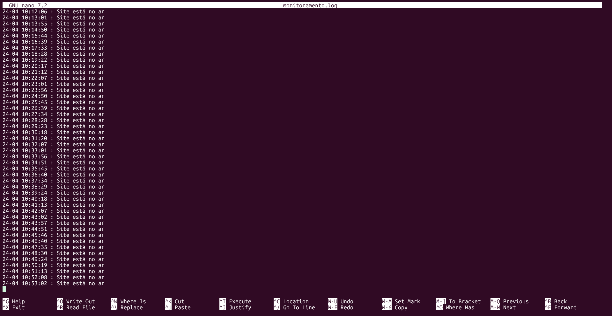

# Projeto 01 - PB DevOps
<p>Neste projeto, foi solicitado o desenvolvimento de um script de monitoramento de serviços, junto da configuração de um ambiente Linux , a instalação e preparação de um servidor web com o NGINX, a criação de uma página web. O script de monitoramento vai verificar a cada 1 minuto a disponibilidade do site,pode enviar notificações via webhook e registrar logs com data e horário.
</p>

## Sumário
1. Configuração do Ambiente
2. Configuração do Servidor Web
   - Estilização do site
   - Conexão API GitHub
3. Script de Monitoramento
   - Configuração do Webhook do discord
   - Configuração do Cron
4. Conclusão


## Etapa 1 - Configuração do Ambiente

<p>Para configurar o ambiente foi utilizada a ferramenta Subsystem do Windows para a instalação do Ubuntu</p>

 Primeiro, deve-se abrir o CMD como administrador e executar o seguinte comando:

```wsl --install -d Ubuntu```

 Com esse comando é feita a instalação do WSL e do Ubuntu na sua distribuição mais recente disponível.

___

## Etapa 2 - Configuração do Servidor Web

<p>Para configurar o servidor web no Ubuntu foi utilizado o gerenciador de pacotes: <strong>APT-GET</strong></p>

 Com o comando ```APT-GET```, instale no Ubuntu o servidor web ```NGINX```.

```apt-get install nginx```


 Após a instalação, pode ser necessário a configuração da porta que será utilizada. Para isso, acesse ```/etc/nginx/sites-enabled/default```:

```server {
        listen 80 default_server;                                                                                    
        listen [::]:80 default_server;

        root /var/www/html;                                                                                          
                                                                                                                                                           
        index index.html index.htm index.nginx-debian.html;                                                          
                                                                                                                         
        server_name _;                                                                                               
                                                                                                                         
        location / {                                                                                                                                         
                try_files $uri $uri/ =404;                                                                           
        }
} 
```
 Com as configurações e instalação em dia basta executar ``` sudo systemctl start nginx.service``` para iniciar o servidor.
___

## Etapa 2.1 - Estilização do site

<p>Para a estilização do site foi utilizado o CSS, utilizando o recurso Flexbox.</p>


```
 body {
  margin: 0;
  padding: 0;
  height: 100vh;
  display: flex;
}

.bg-esquerda,
.bg-direita {
  flex: 1;
  min-height: 100%;
}

.bg-esquerda {
  background-color: #2D3142;
  display: flex;
  justify-content: center;
  align-items: center;
  flex-direction: column;
}

.bg-direita {
  background-color: #FFFCF9;
}

.avatar {
  width: 500px;
  height: 500px;
  border-radius: 100%;
  background-image: url(/imgs/1723599015889.jpg);
  background-repeat: no-repeat;
  background-size: cover;
}

.bg-direita {
  display: flex;
  flex-direction: column;
  align-content: center;
  justify-content: flex-start;
  align-items: flex-start;
  flex-wrap: nowrap;
}


.bg-direita h1 {
  font-size: 128px;
  margin: 0;
}

.bg-direita span {
  font-size: 40px;
  font-weight: 300;
}

.bg-direita .btns {
  margin-bottom: 30px;
}

.bg-direita .skills {
  width: 790px;
  height: 180px;
  background-color: antiquewhite;
  border-radius: 10px;
  margin-top: 10px;
}

.bg-direita .tudo {
  margin-top: 100px;
  margin-left: 85px;
}

.btns button {
  padding: 5px 25px;
  margin-right: 25px;
  border: none;
  border-radius: 10px;
  font-size: 14px;
  font-weight: bold;
  cursor: pointer;
}

.btns button:hover {
  background-color: #8C8C8C;
  transition: ease-in-out 0.2s;
  color: #fff;
}

.btns button img {
  width: 10px;
  height: 10px;
  margin: 0;
}


.bg-esquerda ul {
  list-style: none;
  display: flex;
  justify-content: center;
  align-items: center;
  flex-direction: column;
}


.bg-esquerda ul h1 {
  color: #FFFFFF;
  border-bottom: solid 10px #A6A6A6;
  padding-bottom: 20px;
  width: 620px;
  text-align: center;
  font-size: 64px;
  font-weight: bold;
  margin: 10px;
}

.bg-esquerda ul h2 {
  color: white;
  font-family: 'Gill Sans', 'Gill Sans MT', Calibri, 'Trebuchet MS', sans-serif;
  font-weight: 200;
  font-size: 36px;
  margin: 10px;
}

.bg-esquerda ul strong {
  color: white;
}

.bg-esquerda ul .strong2 {
  color: white;
  font-weight: bolder;
}

.bg-esquerda ul span {
  font-size: 16px;
  font-weight: lighter;
}


#repo-container {
  display: flex;
  flex-direction: row;
  align-items: center;
  gap: 20px;
  flex-wrap: wrap;
  max-height: 200px;
}

.repo {
  width: 400px;
  height: 60px;
  background-color: #F0F0F0;
  border-radius: 10px;
  display: flex;
  justify-content: center;
  align-items: center;
}

.repo:hover {
  background-color: #8C8C8C;
  cursor: pointer;
  transition: ease-in-out 0.2s;
}

.repo a {
  text-decoration: none;
  color: black;
  font-size: 18px;
  font-weight: bold;
}

```

___

### Etapa 2.2 - Conexão API GitHub

<p>Para exibir os repositórios, foi necessário acessar a API do GitHub, que com apenas o nome de usuário retorna todos os repositórios daquele usuário e suas informações</p>


```
fetch('https://api.github.com/users/yuri-ferreira/repos')
  .then(response => response.json())
  .then(repos => {
    const container = document.getElementById('repo-container');
    repos.forEach(repo => {
      const nome = repo.name;
      const url = repo.html_url;

      const repoDiv = document.createElement('div');
      repoDiv.classList.add('repo');

      repoDiv.innerHTML = `
        <a href="${url}" target="_blank">${nome}</a>
      `;
      container.appendChild(repoDiv);
    });
  })
```

``` fetch('https://api.github.com/users/yuri-ferreira/repos') ```
<p>Responsável pela requisição para a API do GitHub</p>

___

## Etapa 3 - Script de Monitoramento

<p>É feito um script de monitoramento que a cada minuto confere se o site está no
ar. Caso esteja offline, o script envia uma mensagem (via webhook) para o Discord. Também é gerado um log, com dia/mês/hora/minuto/segundo</p>




Código abaixo:
```
#!/bin/bash

 discordkey="CONFIDENCIAL"
 log="/var/log/monitoramento.log"
 data=$(date "+%d-%m %H:%M:%S")

  if systemctl is-active nginx; then
  mensagem="$data : Site está no ar"
  else
  mensagem="$data : Site está fora do ar"
  
  curl -H "Content-Type: application/json" \
     -X POST \
     -d "{\"content\":\"$mensagem\"}" \
     "$discordkey"
 
  fi

echo "$mensagem" | tee -a "$log"
```
``` 
 #!/bin/bash

 discordkey="CONFIDENCIAL"
 log="/var/log/monitoramento.log"
 ```

<p>Primeiro é declarada a shebang, após é definido em variáveis a chave do webhook discord e também onde está localizado o log.</p>

``` 
  data=$(date "+%d-%m %H:%M:%S")

  if systemctl is-active nginx; then
  mensagem="$data : Site está no ar"
  else
  mensagem="$data : Site está fora do ar"
  
  curl -H "Content-Type: application/json" \
     -X POST \
     -d "{\"content\":\"$mensagem\"}" \
     "$discordkey"
 
  fi

echo "$mensagem" | tee -a "$log"
```
Nesse código é onde o funcionamento do script acontece. É definido a variável de data, contendo dia/mês/hora/minuto/segundo.

E com isso é feito a estrutura de decisão:
```
if systemctl is-active nginx; then
  mensagem="$data : Site está no ar"
  else
  mensagem="$data : Site está fora do ar"
  
  curl -H "Content-Type: application/json" \
     -X POST \
     -d "{\"content\":\"$mensagem\"}" \
     "$discordkey"
 
  fi
```
Basicamente pode ser traduzida da seguinte maneira:

Caso os serviços do nginx estejam disponíveis:
é armazenado na variável ```$mensagem``` A data e horário e a mensagem "Site está no ar"

Caso o contrário, ou seja, serviços nginx não estão disponíveis:
É armazenado na variável ```$mensagem``` a data e horário e a mensagem "Site está fora do ar".
também, é enviado uma mensagem ao discord utilizando do ```curl e webook```

```
 curl -H "Content-Type: application/json" \
     -X POST \
     -d "{\"content\":\"$mensagem\"}" \
     "$discordkey"
```
Primeiro é definido que o corpo da mensagem do envio da requisição HTTP é no formato **JSON**
``` curl -H "Content-Type: application/json" \ ```

Depois é declarado que a requisição será **POST**:
``` -X POST \ ```

Com isso, é declarado o corpo da mensagem, ou seja, os dados que serão enviados.

```
 -d "{\"content\":\"$mensagem\"}" \
     "$discordkey" 
 ```

Aqui o ***content*** que já foi definido como um **JSON** será enviado contendo a variável ```$mensagem``` e o ```$discordkey``` é a chave de envio do ```webhook```.


Nesse final do script, é feito o registro do log.

``` 
echo "$mensagem" | tee -a "$log"
 ```

O ``` echo "$mensagem" ``` imprime o valor da variável e o ```| (Pipe)``` pega esse resultado e envia como entrada para o próximo comando:
o ```tee``` que registra tanto na tela quanto em um arquivo log.
Após, o ```-a``` acresenta a mensagem ao final do arquivo ao ínves de sobrescrevê-la e o ```$log``` é o caminho para onde está o arquivo ***monitoramento.log***.

## Etapa 3.1 - Criar Webhook no Discord

Para criar um webhook no discord basta seguir os passos:
<ol>
<li>
Criar um servidor no Discord
</li>
<li>
Acessar Configurações do Servidor>Integrações>Webhooks
</li>
</ol>
Após a personalização com nome, canal que será utilizado e imagem é possível copiar a chave do Webhook.


Dessa maneira, quando o servidor está fora do ar a mensagem fica dessa maneira:


## Etapa 3.2 - Configurar o Cron

Para o funcionamento do script é necessário a sua execução. Pode ser feita de forma manual, porém, como foi pedido deve-se executar a cada minuto. Para tal, é utilizado o cron, um utilitário do sistema que consegue executar o script com um tempo definido.

Primeiro deve-se configurar a execução do script, para isso digite:
``crontab -e``

Assim, acessando a configuração do cron é informado o tempo e o script a ser executado

`` * * * * * /var/www/html/monitor.sh ``
Nessa linha, os vários * informam que o tempo para sua execução é any ou seja a cada minuto.

Após isso, o usuário que utiliza o cron deve ter permissão para executar o script e para a escrita do log.

Para as permissões é necessário adicionar o usuário ao grupo "syslog" e alterar as permissões da pasta ``/var/log/`` para os usuários do grupo "syslog" poderem escrever e ler.

`` sudo usermod -aG syslog USUÁRIO ``

`` sudo chmod 775 /var/log ``

___

## Conclusão

Com o ambiente Linux funcionando, o site pronto e o script trabalhando é possível obter o resultado planejado: monitorar com sucesso o funcionamento do site e informar via webhook sua queda e registrar por meio do log seu status a cada 1 minuto.


